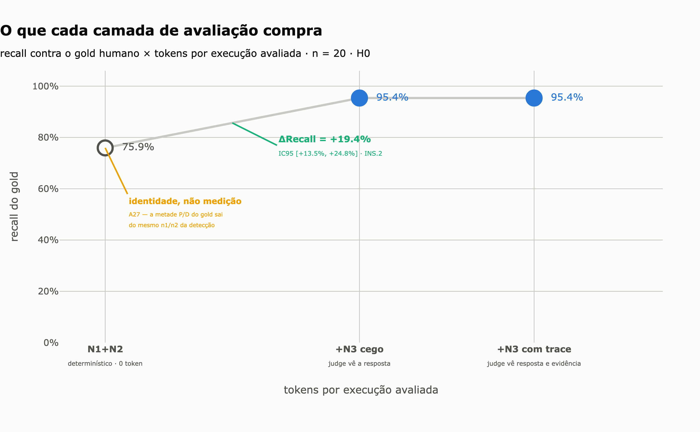
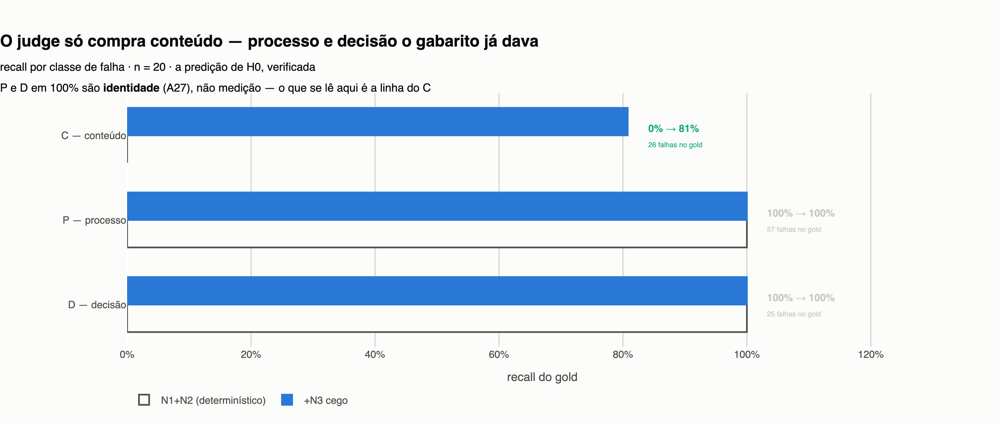

# Framework de avaliação para agentes industriais sobre API estruturada

> **A pergunta deste trabalho não é "o meu agente acerta?".
> É "onde compensa pagar por LLM para *medir* um agente?".**

Dois entregáveis: um **agente** que atende chamados de manutenção industrial contra a API do
parceiro, e um **framework de avaliação** que mede agentes desse tipo em quatro camadas de custo
crescente. O agente é o corpo de prova; o objeto de estudo é o instrumento.

**O resultado principal, em uma linha:** a camada determinística cobre falhas de *processo* e de
*decisão*; **conteúdo exige LLM, e só conteúdo.**

| | |
|---|---|
| `ΔRecall(N3 \| N1+N2)` | **+19,4%**, IC95 [+13,5%, +24,8%] · n = 20 |
| por classe de falha | **P 100% · D 100% · C 0% → 81%** |
| custo do salto | 0 → 5.015 tokens por execução avaliada |



---

## 1. Problema

Um técnico abre um chamado: *"a bomba P-12 está com ruído anormal, posso liberar a linha?"*. Um
agente com acesso à API de manutenção precisa consultar o ativo, a análise mais recente, o
histórico e a baseline — e então **decidir**: orientar, agir, escalar para um humano, ou perguntar
de volta.

**Errar tem custo assimétrico.** Solicitar retreinamento de um modelo sem base técnica, ou alterar
a configuração de um ativo sem permissão, não se compensa com vinte respostas boas. E a resposta
final **esconde o processo**: um agente pode acertar a conclusão pelo caminho errado, ou consultar
tudo certo e concluir errado.

Avaliar isso não é comparar string com string.

## 2. Recorte da solução

O framework mede em **quatro camadas**, da mais barata à mais cara:

| camada | insumo | custo | o que detecta |
|---|---|---|---|
| **N1** determinístico | trace + gabarito | ~0 | tools chamadas, argumentos, decisão, gate, citações |
| **N2** programático | trace + trajetória | ~0 | cobertura de evidência, ordem, precedências, redundância, budget |
| **N3** LLM-as-judge | resposta (± trace) | ~5k tokens | causa-raiz, limitação declarada, afirmação sem suporte, contradição |
| **N4** humano | resposta | tempo humano | o **gold** — sem ele não existe recall |

O trabalho testa **onde nessa escada o dinheiro compra detecção**.

## 3. Arquitetura

```
cenário (YAML) ─→ runner ─→ agente ReAct ──MCP──→ servidor MCP ──HTTP──→ API do parceiro
                    │            │                      │
                    │            └──── trace ───────────┘
                    ↓                    │
              manifest.json              ↓
                              scorers N1/N2/N3/N4 → ScoreRecord → notebooks → figuras
```

**Três decisões estruturais:**

**Trace imutável, scores derivados.** Todo score é função pura de `(trace, gabarito)` e pode ser
recomputado sem re-executar nada. `tests/test_repro.py` prova isso em dois processos com
`PYTHONHASHSEED` diferente **e bloqueia `socket`** — se algum caminho de pontuação abrisse rede,
"recomputável" deixaria de ser verdade.

**A fronteira é um servidor MCP, não tools no processo do agente.** Instrumentação e controle
vivem no ambiente, não dentro do avaliado: todo `tool_call`, `tool_result` e decisão de gate entra
no trace por ali. Consequência verificada: o framework mede **qualquer** cliente MCP — um agente de
terceiro rodando em stdio produz o mesmo trace da bateria. Custo medido: **0,47 ms** por chamada,
contra 3,0 ms do HTTP (`docs/overhead_mcp.json`).

**Gate de ação com reserva de `seq`.** As 5 tools de alto impacto passam por uma política antes de
executar. O gate **reserva** o número de sequência antes de emitir o `tool_call`, porque a ordem
ingênua daria ao gate um `seq` maior que o da chamada que ele autoriza — e o scorer marcaria
"ação sem permissão" (S0) em toda ação corretamente aprovada.

Detalhes em [`docs/ARQUITETURA.md`](docs/ARQUITETURA.md).

## 4. Instalação e execução

```bash
make install                  # venv + dependências
make api                      # noutro terminal: sobe a API do parceiro em :8000
make test                     # 1.154 testes
make repro                    # reprodutibilidade ponta a ponta (~1min15)
```

**Rodar uma bateria e pontuá-la:**

```bash
python -m tapieval.runner  --manifest configs/bateria_principal.yaml --paralelismo 1
python -m tapieval.scoring --bateria runs/principal_2026_08      # N1+N2, offline
```

`make repro` é a demonstração de ponta a ponta: de um clone limpo até uma figura que saiu de trace
real, sem passo manual no meio. Ele executa os notebooks versionados e **reprova** se alguma figura
declarada não for regravada no disco. Instruções completas em `docs/REPRODUZIR.md`.

## 5. Modelos e configurações

| | SUT 1 | SUT 2 | referência | judge |
|---|---|---|---|---|
| id | `qwen3-8b-mlx` | `qwen3-14b-mlx` | `gemini-3.7-flash` | `gemini-3.6-flash` |
| servido por | LM Studio (local) | LM Studio (local) | Vertex AI | Vertex AI |
| quantização | 4 bit | 4 bit | — | — |
| temperatura | 0,7 | 0,7 | 0,7 | 0 |
| janela | 16 384 | 16 384 | — | — |
| saída estruturada | `json_schema` | `json_schema` | `json_schema` | `json_schema` |
| honra `seed` | **não** | sim | — | — |

**`honra_seed: false` no 8B é declaração, não descuido:** o 8B devolve texto diferente para a
mesma seed (medido na T0b e reconfirmado na piloto). Com `false`, `ModelConfig.seed` vai a `None`
— declarar uma seed que o servidor ignora seria declarar um determinismo que a bateria não tem.

**O judge não é nenhum dos SUTs**, por regra do construtor: juiz igual a réu prefere as próprias
respostas. Ele está **congelado** — rubrica v2, sha `bb38b6ef9778`, tag `judge-v2-frozen` —, e o
manifesto de cada bateria declara contra qual judge ela se comprometeu, com o sha **conferido ao
carregar**. Retomar uma bateria sob outro judge é erro.

## 6. Metodologia experimental

**Corpus:** 24 cenários — **16 oficiais**, com gabarito escrito pelo parceiro, e 8 autorais. Split
fechado em **6 dev / 18 test**, 19 regras de decisão em `scenarios/_regras_decisao.yaml`. Os 16 de
terceiro são a defesa contra viés de gabarito: separação estrutural é mais forte que
auto-pré-registro.

**Taxonomia congelada com hash.** 19 códigos (P1–P6 processo, C1–C7 conteúdo, D1–D6 decisão),
congelados em 24/08 **antes** de qualquer resultado do test ser inspecionado, com o sha recalculado
a cada suíte. Se as categorias fossem criadas enquanto se lê o resultado, toda falha encontraria um
balde, o recall de cada camada tenderia a 100% por construção, e o ganho incremental deixaria de
significar coisa alguma.

**Dois eixos de seed, nunca colapsados.** `env_seed` (o mundo) fica **fixa** na bateria principal;
`sample_seed` (a estocasticidade do modelo) varia entre as 8 repetições. Se as repetições
variassem o mundo, o `pass^k` mediria robustez ao ambiente em vez de consistência do modelo. As 8
seeds foram fixadas **a priori** e não se re-sorteiam.

**Gold humano cego.** 35 rotulagens sobre a bateria de calibração, divididas em duas amostras que
**nunca se misturam**: *estimativa* (20, aleatória estratificada — entra em κ e recall) e
*melhoria* (15, escolhida por desacordo — serve para consertar a rubrica e é proibida no κ, porque
concordância medida em casos difíceis não estima concordância na população). A cegueira é imposta
por construção no código e verificada por mutação.

**Baterias:**

| bateria | matriz | execuções | serve a |
|---|---|---|---|
| principal | 18 test × 2 modelos × 8 `sample_seed` | 288 | H0, H2, `pass^k` |
| mutantes | 6 dev × 1 modelo × (4 MUT + base) × 5 seeds | 150 | INS.9 — poder do instrumento |
| referência | 6 dev × fronteira × 4 seeds | 24 | teto de leitura |

## 7. Resultados

### 7.1 H0 — onde compensa pagar por LLM



| camada | recall | falso alarme | tokens/execução |
|---|---|---|---|
| N1+N2 | 0,759 ⚠️ *identidade, não medição* | 0,000 | 0 |
| **+N3 cego** | **0,954** | 0,010 | 5.015 |
| +N3 com trace | 0,954 | 0,037 | 8.460 |

**`ΔRecall(N3 | N1+N2)` = +19,4%, IC95 [+13,5%, +24,8%]** — não cruza zero. E a estratificação é a
predição do `ARQUITETURA §12` literal: **P 100% · D 100% · C 0% → 81%**, com o ganho inteiro em C1
(causa-raiz) e C4.

> ⚠️ **O valor absoluto do primeiro ponto não é medição.** A metade P/D/C5 do gold é **derivada**
> do mesmo `n1`/`n2` que a detecção — o rotulador responde os campos da rubrica, e o código sai de
> `classificar_falhas`. Ali `Recall(N1+N2)` é identidade. É exatamente por isso que o número
> reportado é o **Δ**: a diferença cancela a parte idêntica.

**O segundo ponto de N3 não paga:** Δ = 0,0 com o IC cruzando zero, custo quase dobrado, falso
alarme de 1,0% para 3,7%. Mas a leitura honesta **não** é "dar o trace ao judge não acrescenta": o
gold é cego, `contradiz_evidencia`, `afirmacoes_sem_suporte` e `recomendou_acao_sem_base` vêm
`None` nele, e os três códigos que só o judge com trace detecta (C2, C3, C7) **não existem no
gold**. A frase que os dados sustentam é *"o gold não tem como dizer se acrescenta"*.

### 7.2 Validação do instrumento

**κ contra o rótulo humano** (INS.6, n=20, ambos cegos):

| campo | κ | faixa |
|---|---|---|
| `responde_a_pergunta` | 1,000 | excelente |
| `mencionou_limitacao_relevante` | 0,800 | aceitável |
| `causa_raiz_correta` | **0,565** | **insuficiente** |

O κ mais baixo é o do campo que emite **C1**, o código mais citado do corpus. É a fraqueza que mais
importa, e está na tabela em vez de numa nota de rodapé.

**Flip rate** (INS.7 — o judge 5× sobre os mesmos itens), que motivou a reescrita da rubrica:

| campo | v1 | v2 |
|---|---|---|
| `mencionou_limitacao_relevante` | 29,5% | **11,4%** |
| `causa_raiz_correta` | 18,2% | 20,5% |
| `recomendou_acao_sem_base` | 0,0% | 13,6% |

A v2 foi escrita para o campo que estava pior e ganhou 18 pontos nele; os outros dois pioraram
dentro do ruído de 22 itens. A comparação pareada está em `nb03`.

### 7.3 O agente, como corpo de prova

O contraste que o SUT de referência existe para produzir:

| | conclui dentro de 12 tool calls |
|---|---|
| Qwen3 8B / 14B (4 bit, local) | 43% |
| `gemini-3.7-flash` (fronteira) | **24 de 24** |

Execução que estoura o orçamento sem responder **não é dado perdido**: é falha de processo, medida
pela N2 e classificada como P5. O que ela não sustenta é julgamento de conteúdo.

Todas as figuras, com a frase que cada uma sustenta **e a que ela não sustenta**, em
[`figures/INDEX.md`](figures/INDEX.md).

## 8. Limitações

Na ordem de quanto afetam a conclusão.

1. **n = 20** no denominador do recall. O IC não cruza zero, mas a precisão é baixa e o gold vem de
   cenários de dev. É o limite de tempo humano, a única etapa que não escala com GPU.
2. **A metade determinística do gold é a saída do próprio detector.** `Recall(N1+N2)` é identidade
   em P, D e C5. O ΔRecall é robusto a isso — é o motivo de ele ser o número reportado.
3. **O gold é cego**, então C2/C3/C7 não têm referência e a diferença entre as duas configurações
   do judge não é adjudicável.
4. **κ de `causa_raiz_correta` = 0,565**, abaixo da própria linha de "insuficiente" do projeto.
5. **A amostra de melhoria saiu 15/15 sem resposta final** — a fila prioriza `sem_resposta_final` e
   42 execuções empatam no topo. Ela não entra no κ nem no recall.
6. **O sucesso binário satura.** O corte de `METRICAS §6.5` (ausência de S0/S1/S2) dá 0 para todos
   os modelos em N1+N2, inclusive para o de fronteira, porque P1 exige cobertura evidencial
   perfeita e vale S2. A variante "sem S2", que o próprio documento define, discrimina — e as duas
   curvas vão lado a lado. Afrouxar P1 agora seria mexer em taxonomia congelada **depois** de ler
   o resultado.
7. **O teto de leitura é um `flash`, não um `pro`** — o `gemini-3.6-pro` não existe no catálogo,
   conferido com controle passando na mesma sonda. Teto mais baixo **favorece** os SUTs locais: é
   viés na direção confortável.
8. **O congelamento do judge é de prompt e id, nunca de peso.** O alias do provedor é mudo.
   Mitigação: canário de entrada fixa antes e depois de cada bateria.
9. **`env_seed` fixa** elimina variância ambiental por construção — o `pass^k` reportado é **limite
   superior** de confiabilidade.
10. **Um domínio, dados fictícios**, 5 cenários autorais no test sem potência para comparar autoral
    × oficial (reportado como descritivo, nunca como teste de hipótese).

## 9. Evolução

**O que destravaria mais, em ordem de retorno:**

1. **Segunda rotulagem humana com evidência à vista.** É o que torna adjudicável a diferença entre
   as duas configurações do judge — hoje o gold não alcança C2, C3 e C7.
2. **Eixo de `env_seed` e de perturbação no runner.** Sem eles, as baterias de ambiente e
   metamórfica não rodam, e a hipótese sobre variância ambiental (H4) morreu por falta de eixo, não
   por falta de madrugada. As duas matrizes estão escritas por extenso no cabeçalho dos YAMLs, com
   o bloqueio de código nomeado.
3. **Gold independente para P e D**, para o recall da camada barata deixar de ser identidade.
4. **Agente segregado por modo** (hipótese cortada): dobraria a bateria principal e compraria um
   resultado sobre o agente ao preço do `pass^k`, que é o resultado sobre o instrumento. A flag
   está implementada; a hipótese fica declarada.

---

## Mapa do repositório

| caminho | o quê |
|---|---|
| `src/tapieval/mcp/` | servidor MCP, tools, gate de ação, instrumentação |
| `src/tapieval/sut/` | agente ReAct, variantes e mutantes, SUT de referência |
| `src/tapieval/runner/` | matriz de bateria, manifesto, judge congelado |
| `src/tapieval/scoring/` | N1, N2, N3, severidade, `pass^k`, κ, **INS** |
| `src/tapieval/labeling/` | CLI de rotulagem cega |
| `scenarios/` | os 24 cenários e as 19 regras de decisão |
| `configs/` | as cinco baterias e o congelamento do judge |
| `runs/` | traces, manifestos e scores — **versionados**, é o dado |
| `notebooks/` | nb01–nb04 · `figures/INDEX.md` mapeia figura → afirmação |
| `docs/APRESENTACAO.md` | roteiro, decisões com o porquê, banco de perguntas |
| `docs/ARQUITETURA.md` · `METRICAS.md` · `CENARIOS.md` | as decisões de desenho, com o porquê |
