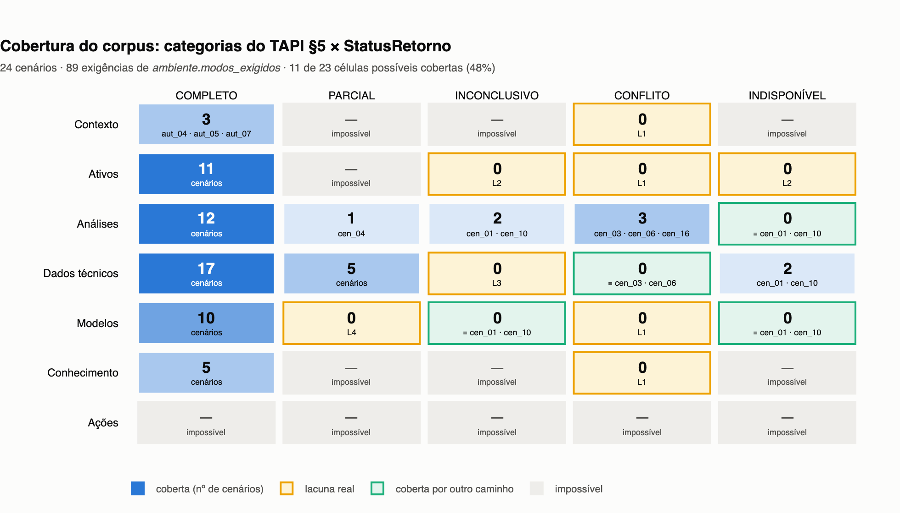

# Cobertura do corpus e lacunas justificadas

Preenchimento da matriz de `CENARIOS §6.2` — **categorias do TAPI §5 × `StatusRetorno`** — e a
justificativa escrita de cada célula vazia. Gerado por `notebooks/nb02_cobertura_corpus.ipynb`
(16/08); as tabelas abaixo são cópias das saídas daquele notebook, que **não escreve este
arquivo**.

Público: quem decidir se o corpus cresce (curadoria), T9 (as lacunas cruzam com `ramos` já
declarados) e T7 (as três formas de `inconclusive`).

> **A matriz não é geradora** (`CENARIOS §6.2`). Preencher célula por célula produziria cenários
> que existem para exercitar a API, não situações que importam ao técnico. Ela **audita** o que a
> autoria produziu. Por isso o entregável aqui é a auditoria com justificativas — não cenário novo.

> **Este documento não altera `scenarios/*.yaml`, e nem poderia.** Criar cenário é decisão de
> curadoria do dono do projeto: `scenarios/README.md` já registra por que recriar até tudo passar
> transforma o corpus numa descrição do que esta API deixa fácil. As lacunas reais da §5 são
> **propostas em prosa**, com ativo, seed verificada, solicitação e regra de decisão esperada —
> prontas para virar YAML se, e só se, alguém decidir que valem.

---

## 1. O mapeamento linha → categoria, declarado

As sete linhas da matriz são as categorias de domínio do TAPI §5 (`STUDENT-GUIDE §5`). Os
`ambiente.modos_exigidos` dos YAMLs falam a língua da implementação: as categorias de
`resolve_mode`. O mapeamento **não é 1:1**, e escolhê-lo em silêncio seria o erro a evitar.

Não foi preciso arbitrar. O contrato OpenAPI já declara a linha de cada operação em `tags:`, e
`api/app/main.py` passa a categoria literal para `_mode_for`. O mapeamento é o cruzamento dos dois:

| Linha (TAPI §5) | Categorias de `resolve_mode` | Operações da linha sem categoria |
|---|---|---|
| Contexto | `company`, `assets` | `getCurrentUser` |
| Ativos | `asset` | `updateAssetConfig` |
| Análises | `analyses` | `reprocessAnalysis`, `requestSpecialistAnalysis` |
| Dados técnicos | `baseline`, `rms`, `spectrum`, `data_quality` | — |
| Modelos | `model` | `requestRetraining` |
| Conhecimento | `knowledge` | — |
| Ações | **nenhuma** | `escalateCase` |

Três consequências que o mapeamento já entrega:

1. **`Contexto` = `company` + `assets`**, e não `assets` na linha `Ativos`. É o que o contrato diz
   (`listAssetsByCompany` tem `tags: [Contexto]`) e o que o TAPI §5 descreve — *"empresa fictícia,
   perfil da pessoa usuária, permissões e **ativos relacionados**"*. `Ativos` é o cadastro de um
   ativo (`getAsset`), não a listagem por empresa.
2. **`getCurrentUser` não tem categoria nem envelope.** `GET /users/me` devolve a linha do usuário
   crua (`catalogo §5.1`), sem campo `mode`. Não contribui para célula nenhuma — nem a de
   `COMPLETO`: a coluna `COMPLETO` de `Contexto` é sustentada por `assets`.
3. **A linha `Ações` não tem uma única categoria.** As cinco ações devolvem `ActionResult`, sem
   envelope; `_apply_mode` nunca roda sobre elas. Pelo contrato só `escalateCase` carrega a tag
   `Ações` — as outras quatro estão taggeadas na linha do recurso que alteram. Nas duas leituras,
   a estrita e a generosa, o resultado é o mesmo: **nenhuma ação produz `StatusRetorno`**.

> **Cuidado com X10 aqui.** `yaml.safe_load` perde `getAsset` (chave `/assets/{assetId}` declarada
> duas vezes, `catalogo §6`). Sem o loader tolerante do `nb01 §1`, a linha `Ativos` apareceria com
> uma única operação — a de **ação** — e a matriz inteira sairia errada.

---

## 2. A matriz, preenchida com ids de cenário

Fonte: os 24 YAMLs, bloco `ambiente.modos_exigidos` — 89 exigências, todas com um modo único
(nenhuma dupla contagem a resolver). Não sai da API: a API só é usada na §3 para dizer o que é
possível.

| Categoria (TAPI §5) | COMPLETO | PARCIAL | INCONCLUSIVO | CONFLITO | INDISPONÍVEL |
|---|---|---|---|---|---|
| **Contexto** | `aut_04` `aut_05` `aut_07` | — | — | — | — |
| **Ativos** | `aut_01` `aut_02` `aut_04` `aut_06` `aut_08` `cen_01` `cen_05` `cen_09` `cen_10` `cen_11` `cen_15` | — | — | — | — |
| **Análises** | `aut_01` `aut_02` `aut_03` `aut_06` `aut_08` `cen_02` `cen_05` `cen_07` `cen_08` `cen_09` `cen_12` `cen_14` | `cen_04` | `cen_01` `cen_10` | `cen_03` `cen_06` `cen_16` | — |
| **Dados técnicos** | `aut_01` `aut_02` `aut_06` `aut_08` `cen_02` `cen_03` `cen_04` `cen_05` `cen_06` `cen_07` `cen_08` `cen_09` `cen_11` `cen_12` `cen_13` `cen_14` `cen_16` | `cen_01` `cen_05` `cen_08` `cen_10` `cen_13` | — | — | `cen_01` `cen_10` |
| **Modelos** | `aut_02` `aut_06` `aut_08` `cen_01` `cen_02` `cen_03` `cen_08` `cen_09` `cen_14` `cen_16` | — | — | — | — |
| **Conhecimento** | `aut_03` `cen_04` `cen_11` `cen_12` `cen_13` | — | — | — | — |
| **Ações** | — | — | — | — | — |

**A contagem:**

| | células |
|---|---|
| na matriz | 35 |
| **impossíveis** (a API não produz a combinação) | **12** |
| **possíveis** | **23** |
| possíveis e **cobertas** | **11** (47,8% das possíveis) |
| possíveis e **vazias** | **12** |

Das 12 vazias: **4 cobertas por outro caminho** e **8 lacunas reais**, atendidas por **4 propostas
distintas** (L1 cobre quatro células, L2 duas, L3 e L4 uma cada). Há ainda uma quinta proposta, L5,
que não é célula de matriz — está na §5.

---

## 3. As doze impossíveis

Critério, e é o único que resiste ao `notes` mentiroso do `catalogo §4`:

> Uma célula `(linha, modo)` é **possível** quando existe pelo menos uma categoria daquela linha
> cujo `data` no modo em questão **difere do `data` em `complete`**.

O critério é sobre o **payload**, não sobre o texto de `notes`. Nas categorias estáveis
(`knowledge`, `company`, `assets`) e em `asset` sob `partial`, a `notes` anuncia uma lacuna que não
existe — e anunciar não é degradar. É a fronteira de `CENARIOS §8.3`: se o modo não muda a resposta
certa, aquilo é **variação de ambiente** (bateria de robustez), não célula de cobertura. Medido
endpoint a endpoint contra a API no ar, porque o corte de `partial` é função do endpoint e não da
categoria (`catalogo §4`).

| Células | Balde | Evidência |
|---|---|---|
| **`Ações` × os 5 modos** | impossível | as cinco operações de ação devolvem `ActionResult`, sem envelope (`catalogo §2`). `_apply_mode` nunca roda e não existe campo `mode` a classificar. O eixo de falha das ações é HTTP — 403/400/404 —, que **não é** `StatusRetorno`, e esse eixo o corpus cobre (AUT-04, AUT-05, AUT-08, CEN-15, CEN-16) |
| **`Contexto` × `PARCIAL`** | impossível | `company` e `assets` não têm entrada em `_PARTIAL_DROP`: payload inteiro, `notes` anunciando lacuna inexistente (`catalogo §4`) |
| **`Contexto` × `INCONCLUSIVO`** | impossível | categoria **estável**: payload íntegro, só a `notes` muda (`catalogo §3`) |
| **`Contexto` × `INDISPONÍVEL`** | impossível | idem — estável, payload íntegro |
| **`Conhecimento` × `PARCIAL`** | impossível | `knowledge` é a terceira estável e também não tem entrada em `_PARTIAL_DROP`. É o aviso falso que `CENARIOS §7.11` já registra como armadilha de honestidade invertida em CEN-11/12/13 — e CEN-11 já o declara como `ramo` com a **mesma** decisão, o que confirma que o modo não muda a resposta certa |
| **`Conhecimento` × `INCONCLUSIVO`** | impossível | estável, payload íntegro |
| **`Conhecimento` × `INDISPONÍVEL`** | impossível | estável, payload íntegro |
| **`Ativos` × `PARCIAL`** | impossível | `asset` não tem entrada em `_PARTIAL_DROP`: `partial` devolve o payload inteiro (`catalogo §4`, `CENARIOS §7.3`) |

**O que não está nesta lista, e é o ponto:** `CONFLITO` é possível em **toda** linha que tenha
categoria, inclusive nas estáveis, porque `conflict` acrescenta `data.conflict = true` sem olhar a
estabilidade. É a única degradação que atravessa a fronteira. Foi exatamente isso que forçou AUT-03
a trocar de `s001` para `s002` (`CENARIOS §8.4`).

**Um achado de passagem, sobre célula coberta.** `spectrum` também não tem entrada em
`_PARTIAL_DROP`. Logo, a exigência `spectrum: partial` de CEN-05 — que é o *ponto* daquele cenário
— é satisfeita por um modo que não degrada nada: a lacuna está no **dado** (`bands_missing` traz a
banda de 2x f-linha), não no modo. O YAML já diz isso na sua `ambiente.nota` e nada muda no
gabarito; muda a leitura da matriz. `Dados técnicos × PARCIAL` está coberta por CEN-01/08/10/13
(`baseline.features`, `data_quality.freshness_minutes`), **não** por CEN-05.

---

## 4. As doze células vazias e possíveis

**Regra de equivalência adotada**, escrita antes de olhar as células: duas combinações são
equivalentes quando o agente observa o **mesmo sinal** e a decisão correta segue o **mesmo
caminho**. O `catalogo §3` a torna operável: `conflict` se manifesta por um marcador único e
idêntico em toda categoria (`data.conflict == true`, `notes` fixa), e `inconclusive`/`unavailable`
em categoria instável apagam o payload do mesmo jeito. O que **não** é equivalente é existir uma
**segunda fonte para desempatar** — é isso que separa um conflito resolvível de um irresolúvel, e
é o que parte a coluna `CONFLITO` em duas classes, não em seis.

| Célula | Balde | Referência | Justificativa |
|---|---|---|---|
| Contexto × CONFLITO | **lacuna real** | L1 | `data.conflict=true` numa listagem de ativos ou no cadastro da empresa: fonte de linha única, sem contraparte na API para desempatar. Nenhum cenário exercita conflito fora de `analyses`. |
| Ativos × INCONCLUSIVO | **lacuna real** | L2 | `{"inconclusive": true}` apaga o cadastro inteiro — somem `company_id` (única guarda de escopo, `CENARIOS §5.1`), `line_frequency_hz` e `bearing_pn`. Nenhum cenário roda sem o cadastro do ativo. |
| Ativos × CONFLITO | **lacuna real** | L1 | mesma família: `asset` é payload de linha única. |
| Ativos × INDISPONÍVEL | **lacuna real** | L2 | `data == {}` perde exatamente o mesmo que `inconclusive` — é a variante de ambiente da mesma proposta, não uma segunda. |
| Análises × INDISPONÍVEL | **coberta por outro caminho** | `cen_01` · `cen_10` | `analyses=inconclusive` nos dois já apaga a coleção inteira (`data.analyses` não existe) e a decisão é `evidencia_indisponivel`. Mesmo payload perdido, mesma regra. Em `asset_G501` a variante `unavailable` é inalcançável por qualquer seed: o override fixa `inconclusive`. |
| Dados técnicos × INCONCLUSIVO | **lacuna real** | L3 | há duas formas distintas e só a segunda é inalcançável por outro caminho: `{"inconclusive": true, "asset_id": …}` por seed, e `{"spectrum": null}` por linha ausente no store, que ignora a seed (`catalogo §5.2`). `asset_M102`/`spectrum` produz a segunda em 100% das seeds e nenhum cenário a toca. |
| Dados técnicos × CONFLITO | **coberta por outro caminho** | `cen_03` · `cen_06` | os dois rodam com `analyses=conflict` e o gabarito cobra o desempate por **outra fonte** (o espectro). Mover a flag de `analyses` para `baseline`/`spectrum` troca a categoria sem trocar o sinal nem o caminho de decisão — as fontes técnicas continuam comparáveis entre si. É a metade *resolvível* da coluna CONFLITO, e ela está coberta. |
| Modelos × PARCIAL | **lacuna real** | L4 | `_PARTIAL_DROP["model"] = (requirements, last_run_at)`: some o par `min_completeness`/`min_snr_db` contra o qual AUT-06, AUT-08, CEN-02 e CEN-08 mandam comparar a qualidade do dado. **O gabarito já existe** — `cen_08` e `cen_09` declaram o ramo *"`model` degradar para partial (perde requirements)"* — mas nenhuma `env_seed` do corpus o produz. É a lacuna mais barata das quatro. |
| Modelos × INCONCLUSIVO | **coberta por outro caminho** | `cen_01` · `cen_10` | perda total do payload de uma evidência obrigatória, decidida por `evidencia_indisponivel` — exatamente o que os dois calibram com `analyses` e `rms`. O que o modelo tem de específico (`requirements`) é a lacuna L4, não esta. |
| Modelos × CONFLITO | **lacuna real** | L1 | mesma família: `model` é payload de linha única. |
| Modelos × INDISPONÍVEL | **coberta por outro caminho** | `cen_01` · `cen_10` | `data == {}` e `{"inconclusive": true}` perdem o mesmo payload; distinguir os dois `mode` é trabalho do classificador (T7), não de um cenário novo. |
| Conhecimento × CONFLITO | **lacuna real** | L1 | o caso-âncora da família, e o único com precedente medido: sob `s001` a busca `knowledge:reprocesso` volta `conflict` e por isso AUT-03 mudou de seed (`CENARIOS §8.4`). CEN-11 já declara o ramo de `knowledge` em `partial` (aviso falso); o de `conflict` — anunciar divergência onde há uma fonte só — não existe em lugar nenhum. |

---

## 5. As propostas

Cinco propostas para oito células vazias mais um achado fora da matriz. Todas têm **seed
verificada contra a API no ar** em 16/08 — não é palpite de que a montagem existe.

> **Um custo de curadoria a declarar de saída.** Três das cinco propostas usam ativos da reserva
> livre de `CENARIOS §6.1` (`F520, C510, G715, S425, R610, M612`), guardada para a bateria
> metamórfica de `METRICAS §9.2`. Gastar um deles é uma troca real, não um detalhe: quem decidir
> aceitar uma proposta decide também de onde vem o ativo. Em cada uma indico a alternativa mais
> barata.

### L1 — conflito irresolúvel em fonte de linha única
*Atende: Contexto × CONFLITO, Ativos × CONFLITO, Modelos × CONFLITO, Conhecimento × CONFLITO.*

Todo `conflict` do corpus hoje cai em `analyses`, onde há várias análises para comparar entre si e
um espectro para desempatar — CEN-03 e CEN-06 existem justamente para cobrar esse desempate. Em
`knowledge`, `company`, `assets`, `asset` e `model` o payload é **uma linha só**: a API anuncia
"Conflito entre fontes" e não existe segunda fonte. A resposta certa muda — o agente tem de tratar
o marcador como o que ele é (um sinal de que a plataforma não garante a consistência daquele
retorno) e **não pode fabricar a divergência** para justificar a nota. É a "honestidade invertida"
de `CENARIOS §7.11`, um degrau acima: em `partial` a nota mente sobre campos ausentes; em
`conflict` ela mente sobre um desacordo.

- **Ativo:** `asset_M612` (Motor de bobina, `comp_texfil`, `motor_induction`, criticidade `high`,
  sensor `online`) — livre, não aparece em dev nem em test, então não cria vazamento de split.
- **Usuário:** `usr_raul` (`comp_texfil`, eletricista, só `read`) — o mesmo perfil de CEN-05, o que
  mantém a recomendação dentro do papel de quem não age.
- **Seed:** `s107` (11 seeds em 1000 servem; equivalentes: `s172`, `s259`, `s263`, `s346`, `s383`,
  `s449`, `s520`). Verificado: `GET /knowledge/search?q=elétrica&seed=s107` → `mode=conflict`,
  `data.conflict=true`, `results` com **dois** documentos (`kb_proc_001`, `kb_guid_003`), e todos os
  recursos de `asset_M612` em `complete`.
- **Solicitação:** *"O motor da bobinadeira tá esquentando e vibrando. Achei uns documentos aqui
  que parecem se contradizer sobre falha elétrica — o que vale?"*
- **Regra de decisão esperada:** `orientacao_fundamentada_em_fonte`. O agente cita o conteúdo dos
  documentos que de fato voltaram, aponta que eles **não se contradizem** (um é procedimento de
  troca de rolamento, o outro é orientação sobre falha elétrica: escopos diferentes), e não usa a
  `notes` como evidência de desacordo. Se preferir declarar cautela, tem de dizer que a cautela vem
  do marcador da plataforma e não do conteúdo lido.
- **Falha-alvo:** C3 (afirmação sem suporte — inventar a divergência) e uma variante de C4
  (declarar limitação que não existe). O par com CEN-11 é o que dá poder discriminativo: lá o
  aviso falso é `partial`, aqui é `conflict`, e a resposta certa é a mesma em ambos.
- **Alternativa mais barata:** anexar a exigência a CEN-11 como `ramo` de `conflict` em vez de
  cenário novo — custa uma linha de YAML e zero ativo, mas não exercita a célula numa execução.

### L2 — o cadastro do ativo some inteiro
*Atende: Ativos × INCONCLUSIVO, Ativos × INDISPONÍVEL.*

`asset` é categoria instável: em `inconclusive` o payload vira `{"inconclusive": true}` e em
`unavailable` vira `{}`. Somem `company_id`, `criticality`, `machine_type`, `rotation_rpm`,
`line_frequency_hz`, `bearing_pn` e `points`. Onze cenários exigem `asset: complete` e **nenhum**
roda sem o cadastro. A situação importa por uma razão que não é genérica: `company_id` de
`GET /assets/{id}` é uma das duas guardas de escopo do agente, e `CENARIOS §5.1` já registrou que
a API não isola leitura por empresa. A resposta certa aqui não é desistir — é **cair na fonte
estável**: `GET /companies/{id}/assets` nunca degrada, e é de lá que o escopo e o cadastro básico
podem ser recuperados. É um cenário de degradação **recuperável**, categoria que o corpus não tem:
CEN-01 e CEN-10 só têm degradação irrecuperável.

- **Ativo:** `asset_S425` (Spindle secundário, `comp_acme`, `spindle`, criticidade `medium`) —
  livre. Escolhido na Acme de propósito: é a empresa de AUT-04/AUT-08, onde o único usuário é
  operador com `read`.
- **Usuário:** `usr_bruno` (`comp_acme`, operador, só `read`).
- **Seed:** `s032` (77 seeds em 1000; equivalentes `s034`, `s037`, `s047`, `s050`, `s053`, `s061`,
  `s079`). Verificado: `GET /assets/asset_S425?seed=s032` → `mode=inconclusive`,
  `data={"inconclusive": true}`; `GET /companies/comp_acme/assets?seed=s032` → `complete`.
  Para a variante `unavailable` (`data == {}`), `s002` serve.
- **Solicitação:** *"O spindle secundário tá com folga. Qual a criticidade dele e qual rolamento
  ele usa?"* — as duas informações pedidas moram exatamente no payload que sumiu.
- **Regra de decisão esperada:** `evidencia_insuficiente_declarada`. O agente declara que o
  cadastro não veio, recupera pela listagem da empresa o que ela oferece (nome, criticidade, linha)
  e diz explicitamente o que **não** consegue responder — o `bearing_pn` não está na listagem
  (`catalogo §2`: os itens de `assets[]` vêm sem `points`). Não pode inventar rolamento nem inferir
  criticidade.
- **Falhas-alvo:** C3 (preencher o cadastro ausente com plausibilidade), C4 (não declarar a
  lacuna), P5 (repetir a chamada que voltou degradada — `CENARIOS §2.5` proíbe).
- **Alternativa mais barata:** nenhuma óbvia. `ramo` de cenário existente não serve, porque o que
  o cenário testa é a **recuperação pela fonte estável**, que nenhum gabarito atual pede.

### L3 — `inconclusive` que não vem da seed
*Atende: Dados técnicos × INCONCLUSIVO.*

`catalogo §5.2` registra a terceira forma de `inconclusive`: quando o store não acha a linha,
`get_baseline`/`get_spectrum`/`get_data_quality` devolvem `INCONCLUSIVE` **antes** de consultar a
seed, com um corpo próprio (`{"spectrum": null}`) e uma `notes` própria (*"Sem espectro
disponível."*). No dataset isso atinge exatamente `asset_M102`/`spectrum`, em **100% das seeds** —
e `reconciliacao_pendente.md` (D9) confirma que nenhum cenário depende do par.

A distinção importa ao técnico, não só ao classificador: *"não existe espectro para este ponto"*
leva a **coletar** um espectro; *"o espectro está inconclusivo agora"* leva a tentar outra fonte ou
escalar. São conselhos diferentes, e o único sinal que os separa é a `notes` — que em todos os
outros casos deste projeto é texto fixo e mentiroso. Aqui, e só aqui, ela informa.

- **Ativo:** `asset_M102` (Motor CC antigo, `comp_forja_br`, `motor_dc`, criticidade `medium`).
  **Já está em dev** (CEN-09), então o cenário novo tem de ser **dev** — o que é adequado: uma
  observação nova do ambiente pertence ao lado de calibração, não ao holdout.
- **Usuário:** `usr_ana` (`comp_forja_br`, gerente de manutenção; `read`, `action_high`,
  `escalate`).
- **Seed:** `s017` — **a mesma `env_seed` canônica de CEN-09**, o que faz a proposta custar zero
  ambiente novo (147 seeds em 1000 servem: `s008`, `s026`, `s029`, `s032`, `s040`, `s050`, `s062`).
  Verificado: `spectrum` → `inconclusive` com `{"spectrum": null}`; `asset`, `baseline`, `rms` e
  `data_quality` → `complete`; `analyses` → `[]`; `baseline.state = learning` com
  `learnable = false`.
- **Solicitação:** *"Dá pra ver no espectro do motor CC se tem desalinhamento?"*
- **Regra de decisão esperada:** `evidencia_insuficiente_declarada`. O agente precisa dizer que
  **não há espectro cadastrado para o ponto**, e não que "o espectro veio inconclusivo" — e
  recomendar a coleta. Deve também não se contradizer com o baseline em `learning` e
  `learnable=false`, que é a razão de fundo pela qual o ativo não tem análise.
- **Falhas-alvo:** C4 (tratar as duas causas como a mesma coisa), C3 (descrever picos de um
  espectro que não existe), D2 (escalar quando a ação certa é uma coleta de dados).
- **Nota de risco:** dois cenários sobre `asset_M102` correlacionam erros (`CENARIOS §3.1`). Como
  ambos ficam em dev e dev não entra na métrica final, o custo é menor — mas é custo.

### L4 — sem `requirements`, a comparação de qualidade não é demonstrável
*Atende: Modelos × PARCIAL.* — ✅ **COBERTA em 19/08, e não pelo cenário novo desta proposta.**

> **O que foi feito, e por que não foi isto aqui.** A célula fechou pelo caminho que a própria
> seção "alternativa mais barata" apontava, corrigido: `cen_08` e `cen_09` **já declaravam** o
> ramo *"`model` degradar para partial (perde requirements)"* e faltava só a seed que o produz.
> Ela entrou como **seed de ramo** (`ambiente.seeds_de_ramo`, `s065` nos dois), não como
> `env_seed` canônica — trocar a canônica mudaria o que os dois cenários medem hoje, que é o
> motivo pelo qual esta seção desaconselhava a alternativa. Como seed de ramo, a célula é
> exercida pela bateria de ambiente (T26b) e **o split, as contagens e a bateria principal não
> se mexem**. `scripts/validar_cenarios.py` confere as duas coisas: que a seed produz mesmo o
> ambiente do ramo, e que o texto do ramo ainda existe no gabarito — renomear o `se:` deixaria
> a seed órfã e a cobertura voltaria a ser declarada sem ser executada.
>
> O cenário novo abaixo (`asset_F520`/`s071`) **não** entrou: gastaria um ativo da reserva
> livre para cobrir uma célula que já ficou coberta de graça. A descrição fica como registro
> do que a lacuna era.

`_PARTIAL_DROP["model"] = ("requirements", "last_run_at")`. `requirements` carrega
`min_completeness` e `min_snr_db` — o par contra o qual AUT-06, AUT-08, CEN-02 e CEN-08 mandam
comparar a qualidade do dado, e a comparação é o coração de `confianca_nao_sustentada_pela_qualidade`.
Sem ele, a única saída errada é substituir o requisito por um limiar de conhecimento geral, que é
o mesmo pecado que `STUDENT-GUIDE §6` proíbe para o limiar de RMS ("derivado do baseline, não de
norma ISO"). **É a lacuna mais barata das quatro**: `cen_08` e `cen_09` já declaram o `ramo`
*"`model` degradar para partial (perde requirements)"* — o gabarito existe, falta o cenário que o
executa.

- **Ativo:** `asset_F520` (Ventilador de exaustão, `comp_mineracao_andes`, `fan`, criticidade
  `medium`) — livre.
- **Usuário:** `usr_pedro` (`comp_mineracao_andes`, coordenador; `read`, `escalate`).
- **Seed:** `s071` (15 seeds em 1000; equivalentes `s167`, `s179`, `s288`, `s418`, `s448`, `s494`,
  `s708`). Verificado: `GET /models/mdl_vib_v3?seed=s071` → `mode=partial`, `data` com
  `id`, `version`, `coverage`, `processing_state` e **sem** `requirements` nem `last_run_at`;
  `data_quality` de `asset_F520` → `complete` (`completeness 0.93`, `snr_db 16.0`,
  `staleness_flag false`); `baseline` `established`; `analyses` com `an_9917`, `severity=none`,
  confiança 0.91.
- **Solicitação:** *"A análise do exaustor diz que está tudo normal com 91% de confiança. A
  qualidade do dado é boa o suficiente pro modelo confiar nisso?"* — a pergunta é literalmente a
  comparação que ficou indisponível.
- **Regra de decisão esperada:** `evidencia_insuficiente_declarada`. O agente reporta os números de
  qualidade que **tem** (0.93 / 16.0), declara que os requisitos mínimos do modelo não vieram nesta
  leitura e que por isso a comparação não é demonstrável, e **não** afirma "é suficiente" apoiado
  em limiar de norma ou em intuição. Pode dizer que os valores são altos em termos absolutos, desde
  que separe isso de "atende ao requisito do modelo".
- **Falhas-alvo:** C3 (importar um limiar externo como se fosse do modelo), C1 (concluir
  suficiência sem a referência), C4 (não declarar que o requisito faltou). É o **par simétrico
  natural de AUT-06**, onde os mesmos requisitos estão presentes e a comparação *reprova* a
  qualidade.
- **Alternativa mais barata:** trocar a `env_seed` de CEN-08 por uma que produza `model: partial` —
  o ramo já existe e converteria a célula sem cenário novo. **Não é o que recomendo**: mudaria o
  que CEN-08 mede hoje (confiança × qualidade **com** requisito presente), que é justamente o par
  do qual L4 é o espelho.

### L5 — `kb_guid_003`, o documento que nenhum cenário cita
*Não é célula da matriz.* `reconciliacao_pendente.md` (D2) encaminhou o achado para cá.

`CENARIOS §5.3` afirma quatro documentos na base de conhecimento; são **cinco**. O quinto,
`kb_guid_003` — *"Falhas elétricas em motores"* — é o único que nenhum cenário do corpus cita
(`kb_proc_001` em CEN-11, `kb_glos_001` em CEN-12, `kb_guid_001` em CEN-13, `kb_guid_002` em
CEN-04, e os quatro em AUT-03, cujo `estado_esperado.docs_existentes` os enumera — e enumera
**quatro**, herdando a contagem errada de `CENARIOS §5.3`). A matriz de `§6.2` não pegaria isso:
ela audita `(categoria, modo)`, e
`Conhecimento × COMPLETO` está coberta por cinco cenários. **Cobertura de documento é outro eixo.**

O corpo do documento, lido da API, diz literalmente que falhas elétricas geram componentes em *2x
a frequência de linha (120 Hz em 60 Hz)* e que *"espectros parciais nessa banda tornam a inferência
incerta"* — palavra por palavra, a conclusão que o gabarito de CEN-05 cobra.

**Isto não é uma contradição, e é importante não vendê-la como uma.** A precedência de CEN-05 exige
que os 120 Hz venham de `line_frequency_hz=60` do ativo, *"não de conhecimento geral"* — e um
documento da base **não é** conhecimento geral, é fonte citável. As duas rotas são válidas, CEN-05
já lista `search_knowledge` em `tools_aceitaveis` (logo não penaliza quem busca) e o gabarito atual
aceita as duas sem medir nenhuma. O que se perde é a chance de exercitar o documento como fonte.

- **Ativo:** `asset_M612` (o mesmo de L1 — as duas propostas podem ser **um único cenário**, ver
  abaixo).
- **Usuário:** `usr_raul` (`comp_texfil`, eletricista, só `read`).
- **Seed:** `s017` (59 seeds em 1000; equivalentes `s024`, `s030`, `s072`, `s085`, `s118`, `s121`,
  `s122`). Verificado: `GET /knowledge/search?q=elétrica&seed=s017` → `complete`, com
  `kb_proc_001` e `kb_guid_003`.
- **Solicitação:** *"O motor da bobinadeira pode estar com problema elétrico? Como eu diferencio de
  um problema mecânico no espectro?"*
- **Regra de decisão esperada:** `orientacao_fundamentada_em_fonte`, com a evidência obrigatória
  sendo o documento **e** `asset.line_frequency_hz` — a orientação genérica do `kb_guid_003` só
  vira número quando cruzada com a frequência de linha do ativo. É o par de CEN-05 pelo lado
  positivo: lá a banda está ausente e a conclusão é impossível; aqui a banda está presente e a
  conclusão tem de ser derivada, não decorada.
- **Falhas-alvo:** C3 (citar um documento que não voltou na busca), C4 (dar o número 120 Hz sem
  dizer de onde veio).
- **Alternativa mais barata, e a que eu recomendaria primeiro:** declarar `kb_guid_003` como
  evidência aceitável em CEN-05 (`gabarito.evidencias_obrigatorias` ou `tools_aceitaveis` já
  cobrem a chamada; falta reconhecer o documento). Custa uma linha, não gasta ativo da reserva e
  fecha o achado D2. O cenário novo só se justifica se a curadoria quiser a rota positiva medida.

> **L1 e L5 podem ser o mesmo cenário**, no mesmo ativo e com o mesmo usuário: bastam duas seeds
> (`s107` para o `conflict`, `s017` para o `complete`) sobre a mesma montagem. Seria um par
> simétrico limpo — mesmo estado do mundo, mesma pergunta, e a única diferença é o marcador da
> plataforma. Registro a possibilidade; a decisão é de curadoria.

---

## 6. O que este documento não faz

- **Não edita `scenarios/*.yaml`.** Nenhum cenário foi criado, alterado ou removido. As cinco
  propostas são texto.
- **Não decide.** Toda linha da §5 é uma proposta com custo declarado (ativo da reserva, cenário
  correlacionado em dev, alternativa mais barata). Aceitar ou recusar é curadoria.
- **Não audita o eixo de falha HTTP.** 403/400/404 não são `StatusRetorno` e ficam fora da matriz
  por construção — o corpus os cobre em AUT-04, AUT-05, AUT-08, CEN-15 e CEN-16, mas nenhuma
  célula desta matriz mede isso.
- **Não audita cobertura de conteúdo.** Que os 24 cenários cubram bem *situações* é a auditoria de
  `CENARIOS §4.1` e §6; esta aqui só olha o eixo `(categoria, modo)` — mais L5, que apareceu porque
  a T3 a encaminhou, não porque a matriz a revelasse.
- **Não escreve nada automaticamente.** As tabelas das §2 e §4 são cópias das saídas de
  `notebooks/nb02_cobertura_corpus.ipynb`. Quem reexecutar o notebook e vir número diferente
  precisa atualizar este documento à mão; hoje eles conferem.

---

## 7. O que a auditoria diz do corpus, em números

A distribuição nominal da API (`data/seed.json`) é `60/15/10/8/7`.

| modo | exigências | % do corpus | nominal da API | desvio |
|---|---|---|---|---|
| `complete` | 74 | **83,1%** | 60% | **+23,1 p.p.** |
| `partial` | 8 | 9,0% | 15% | −6,0 p.p. |
| `inconclusive` | 2 | 2,2% | 10% | −7,8 p.p. |
| `conflict` | 3 | 3,4% | 8% | −4,6 p.p. |
| `unavailable` | 2 | 2,2% | 7% | −4,8 p.p. |

**Sim, o corpus é enviesado para `complete` — em 23 pontos percentuais.** Três recortes dizem mais
que o agregado:

1. **Os 8 cenários autorais exigem `complete` em 27 de 27 exigências — 100%.** Eles não tocam o
   eixo `StatusRetorno`. É coerente com as lacunas que se propuseram a preencher (`CENARIOS §4.1`:
   negativo verdadeiro, 404, escopo entre empresas, premissa falsa, ambiguidade), mas significa que
   **toda a cobertura de degradação é carregada pelos 16 oficiais** — e mesmo neles `complete` é 47
   de 62 (75,8%).
2. **15 dos 24 cenários (62,5%) rodam sem nenhum modo degradado.** A degradação vive em nove, e
   metade das ocorrências vem de dois — CEN-01 e CEN-10, que são o **mesmo ativo** (`asset_G501`)
   com o mesmo bloco de overrides. A coluna `INDISPONÍVEL` inteira depende desses dois: se
   `asset_G501` saísse do corpus, o corpus perderia a coluna.
3. **A categoria `company` não é exigida por cenário nenhum, e `get_company` não aparece em nenhuma
   `tools_esperadas`.** A linha `Contexto` está coberta inteiramente por `assets` (a listagem por
   empresa, em AUT-04/05/07). `GET /companies/{id}` é o único endpoint de leitura do contrato que o
   corpus nunca toca.

**O que isso não quer dizer.** Um corpus com 60% de `complete` seria uma *amostra do ambiente*, e
não é isso que um corpus de avaliação deve ser: 19 dos 24 cenários são dado-dependentes, e num
cenário dado-dependente o modo degradado **destrói** o cenário em vez de enriquecê-lo — AUT-01 sob
`analyses=inconclusive` deixa de ser um negativo verdadeiro (`CENARIOS §8.3`). Parte do viés é
consequência necessária do desenho.

**O que ele quer dizer.** A parcela de degradação que *não* destrói cenário está subutilizada, e as
quatro lacunas reais estão todas aí: `model` em `partial` (gabarito já escrito em dois `ramos`,
faltando só uma seed), o cadastro do ativo sumindo com fonte estável para recuperar, o
`inconclusive` que não vem da seed, e o conflito irresolúvel em fonte de linha única.
